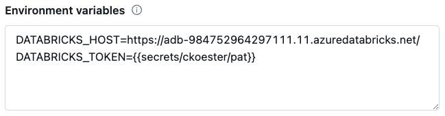

# Databricks SQL Query Logger

Retrieves DBSQL [query history](https://docs.databricks.com/api/workspace/queryhistory/list) and merges it into a Delta Lake table.

A [System Table](https://docs.databricks.com/en/administration-guide/system-tables/index.html) containing similar data is on the Databricks roadmap, so solutions like this will be mostly unecessary in the near future.

## Features
- Ingests DBSQL query history based on supplied parameters
- Supports incremental ingestion
- Works in triggered or continuous mode:
    - `triggered` - ingests data and exits
    - `continuous` - ingests data every N seconds until cancelled

## Getting Started

### Dependencies

* [Deletion Vectors](https://docs.databricks.com/en/delta/deletion-vectors.html) (DBR 14.1 and above) and [Liquid Clustering](https://docs.databricks.com/en/delta/clustering.html) (DBR 13.3 and above). If you need to support an earlier DBR, update the `create_target_table` function accordingly.
* The Python whl includes the [Databricks SDK](https://docs.databricks.com/en/dev-tools/sdk-python.html) 0.25.1. If you use the module directly, be sure to test any other versions prior to use.

### Installation
 
- Download the python whl file from the latest [release](https://github.com/cjkoester/dbsql_query_logger/releases). It is not published to PyPi.
- Upload the whl file as a workspace file or to a Unity Catalog volume
- Option 1: Install as cluster-scoped library
    - Go to the **Libraries** menu of your cluster
    - Select **Install new** and navigate to where you saved the whl
- Option 2: Install as notebook-scoped library
    - Run the following in a notebook cell: `%pip install /path/to/my_package.whl`

See the [libraries](https://docs.databricks.com/en/libraries/index.html) documentation for full details and additional options.

### Usage

The code below shows how to run the DBSQL Query Logger. Refer to docstrings for more details.

The [examples](https://github.com/cjkoester/dbsql_query_logger/tree/main/examples) folder includes a notebook that uses widgets for easy parameterization.

```python
import logging
from dbsql_query_logger import QueryLogger

logging.basicConfig(
    format="%(asctime)s %(message)s",
    datefmt="%Y-%m-%dT%H:%M:%S%z"
)

logger = logging.getLogger('dbsql_query_logger')
logger.setLevel(logging.INFO)

query_logger = QueryLogger(
    catalog = 'chris_koester',
    schema = 'observe',
    table = 'query_history',
    pipeline_mode = 'triggered',
    backfill_period = '24 hours',
    reset = 'no'
)

query_logger.run()
```

### Authentication
[Authentication](https://docs.databricks.com/en/dev-tools/sdk-python.html#authenticate-the-databricks-sdk-for-python-with-your-databricks-account-or-workspace) is handled by the Databricks SDK, which implements the Databricks client unified authentication standard. Examples include:
- [Notebook](https://docs.databricks.com/en/dev-tools/sdk-python.html#use-the-databricks-sdk-for-python-from-a-databricks-notebook) - uses native notebook authentication. No configuration necessary.
- [Environment variables](https://docs.databricks.com/en/dev-tools/auth/index.html#environment-variables-and-fields-for-client-unified-authentication) - environment variable can be set as part of the cluster configuration for scheduled jobs.

